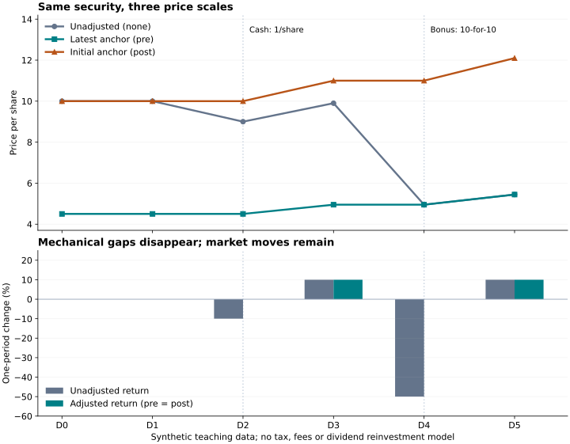

高质量的复权因子exfactor
============================================================

股价从 10 元变成 9 元，不一定代表股东损失了 10%。
如果这一天每股除息 1 元，减少的股价对应了一份现金分配权利。
送股则改变股数：每 10 股送 10 股后，股数翻倍，理论每股价格减半。
直接把这些价格相除，会把公司行动造成的单位变化当成投资损失。

复权因子把不同时点的价格换算到同一个基准，消除这类机械跳变，保留市场涨跌。
本节使用独立构造的教学数据，依次解释事件、因子与价格变化。
下列数值不是某只股票的历史行情，也不需要连接服务端即可复算。

先派现，再送股
----------------------------------------------

假设不计税费，除权日没有额外市场涨跌，且现金分红与送股不发生在同一天：

.. list-table::
   :header-rows: 1
   :widths: 15 45 40

   * - 时点
     - 事件
     - 不复权价格
   * - D0、D1
     - 事件前
     - 10 元
   * - D2
     - 第一次：每股派现 1 元
     - 10 − 1 = 9 元
   * - D3
     - 正常上涨 10%
     - 9 × 1.1 = 9.9 元
   * - D4
     - 第二次：每 10 股送 10 股
     - 9.9 ÷ 2 = 4.95 元
   * - D5
     - 正常上涨 10%
     - 4.95 × 1.1 = 5.445 元

持有 100 股时，D1 的股票价值为 1,000 元；D2 为 900 元股票加 100 元现金权益。
D3 的股票价值为 990 元；D4 则变成 200 股 × 4.95 元，仍为 990 元。
派现与送股本身没有造成表面上的 −10% 和 −50% 损失。
现金实际到账还取决于派发日，不能把除息日与到账日混为一谈。

把单次事件变成累计因子
----------------------------------------------

本库 exfactor 使用 ``PRIOR_CLOSE`` 口径：
单次事件因子等于除权前收盘价除以理论除权价。
它与“乘到历史价格上的向后调整系数”互为倒数，比较数据源时必须先核对方向。

.. math::

   f_{event} = \frac{P_{prev}}{P_{ex,theoretical}},
   \qquad F(t) = \prod_{ex\_date \le t} f_{event}

本例首次派现的因子为 ``10 / 9``\ ，第二次送股的因子为 ``2``\ 。
累计因子在 D2 之前为 1，在 D2、D3 为 ``10 / 9``\ ，从 D4 起为 ``20 / 9``\ 。
事件从除权除息日生效，不能提前到公告日或登记日。

实际除权日价格仍可能因交易而涨跌；计算理论除权价是为了剥离公司行动，
不是为了强制把当天收益设成零。

.. note::

   **复杂公司行动的处理，远不止把几个比例相乘。** 配股需要核对认购价格、
   实际生效的配售比例与股本变化；分拆需要把新分配证券的价值折算到原持股，
   并区分可观察的市场价格与带来源、口径的估值。同日叠加派现、送转或配股时，
   还要统一每股基准和生效时点，避免先后顺序或重复记录造成二次调整。

   因子生产链路会对齐证券身份、事件条款和参考价格，处理修订、撤销与重复记录，
   并结合可用的交易所参考信息进行一致性核验。未生效、条款不完整或无法可靠定价的
   情形与“没有公司行动”分别记录；跨越无法定价事件的复权查询会被阻断，
   不会用一个看似合理的默认因子补齐。具体事件类型的覆盖仍以对应数据集为准。

   可以通过 :func:`~libfinance.get_ex_factor` 查看单次因子、累计因子与除权日期，
   累计历史包含未定价事件时会明确报错；公司行动接口可用于核对对应事件。

三种价格，两个基准
----------------------------------------------

设原始价格为 ``P(t)``\ ，基准日为 ``b``\ ：

.. math::

   P_{adjusted}(t;b) = P(t)\frac{F(t)}{F(b)}

.. list-table::
   :header-rows: 1
   :widths: 22 38 40

   * - 方式
     - 本例计算
     - 保持什么不变
   * - 不复权 ``none``
     - P(t)
     - 当时实际价格尺度，保留除权跳空
   * - 前复权 ``pre``
     - P(t) × F(t) / F(D5)
     - D5 的价格，较早价格换算到 D5 基准
   * - 后复权 ``post``
     - P(t) × F(t)
     - 首次事件前的价格，后续价格换算回初始基准

本例把累计因子的初始值设为 1，因此后复权可直接乘 ``F(t)``\ 。
服务端后复权的初始基准是因子 release 的首个事件之前，
并非每次查询窗口的第一天。

.. literalinclude:: ../../../_shared/figures/exfactor-example.txt
   :language: text

D2 的三种价格分别为 9、4.5、10，D4 分别为 4.95、4.95、11。
前、后复权在同一段数据上仅差一个固定倍数，所以相邻收益率相同，
价格绝对值则不能互换。前复权保持基准日价格，新的公司行动会改变默认最新基准，
因此历史前复权价格可能随数据更新而变化。

   灰色为不复权，绿色为前复权，橙色为后复权。
   D2、D4 的机械跌幅消失，D3、D5 的真实涨幅保留。

可下载 :download:`计算数据 CSV <../../../_shared/figures/exfactor-example.csv>`\ 、
:download:`图片 PNG <../../../_shared/figures/exfactor-example.png>` 和
:download:`复算及绘图脚本 <../../../_shared/generate_exfactor_example.py>`\ 。
脚本生成表格与图片，且核对两次除权的连续性、基准价格及前后复权比例。

复权价格也不是现金账户。若本例 100 元分红一直留作现金，D5 的总资产为
``200 × 5.445 + 100 = 1,189`` 元，累计收益为 18.9%；
复权价格的累计变动则为 21%。资金到账、税费、再投资策略与股数变化，
需要由组合账户单独核算，不能把复权收益无条件当成实盘账户收益。

在 libfinance 中取得三种价格
----------------------------------------------

日常查询由 ``get_price`` 组合原始行情与 exfactor。
下面用真实证券代码演示 API，打印的是服务端结果，不是上面的教学数字：

.. code-block:: python

   import pandas as pd
   import libfinance as lf

   prices = {}
   for mode in ("none", "pre", "post"):
       prices[mode] = lf.get_price(
           "600000.XSHG", "2023-07-17", "2023-07-25",
           fields=["close"], adjust_type=mode,
           adjust_orig="2023-07-25" if mode == "pre" else None,
       )["close"]
   print(pd.concat(prices, axis=1).round(4))
   print(lf.get_ex_factor("600000.XSHG", "2023-07-17", "2023-07-25"))
   print(lf.get_dividends(
       "600000.XSHG", start_date="2023-07-17", end_date="2023-07-25",
   ))

``get_ex_factor`` 以 ``ex_date`` 为索引，返回 ``order_book_id``\ 、\ ``ex_factor``\ 、
``ex_cum_factor``\ 。前者对应单日 ``f_event``\ ，后者对应 ``F(t)``\ ；
累计值从数据版本内该证券首个事件前的 1 起算，不从查询起始日重新累乘。
即使未定价事件早于查询窗口，只要影响累计值也会报错。
中美市场都提供单次及累计因子。
字段与带打印结果的查询示例见 :doc:`../reference/corporate_actions`\ 。

``adjust_orig`` 只为前复权选择基准；不传时使用服务端因子 release 的 cutoff，
不自动等于 ``end_date``\ 。固定基准便于比较多次查询，但它不是知识截止参数，
也不等同于上一节的 ``as_of``\ 。要严格复现，还应固定底层数据版本。

客户端当前会按价格因子的倒数缩放成交量，成交额 ``turnover`` 保持不变。
这是本库的返回口径；现金分红本身不会增加实际成交股数。
研究真实成交量时应查询 ``adjust_type="none"``\ ，避免混用实际股数与复权量。

高质量来自可追溯与校验
----------------------------------------------

光有一条平滑曲线，不能证明复权正确。
本库的因子生产与查询链路需要保证以下几件具体事情：

* **身份连续。** 因子关联永久证券身份，再按查询时点解析代码，避免更名或代码复用串到别的证券。
* **事件正确。** 核对除权日、派现金额、股数比例及事件状态；同日多项行动应正确合成，重复事件不能重复相乘。
* **计算可解释。** 保留定价输入、事件条款、因子来源与状态，计算结果与可用的交易所参考信息交叉核对。
* **缺失不伪装成无事件。** 覆盖外或存在无法定价的事件时应拒绝查询；确认无公司行动时，因子为 1 才有依据。

事件修订或撤销后，应按新版本重新计算累计因子，不能把修订再当成一项新事件叠加。
原始行情、事件记录、复权基准和数据版本共同决定结果，图中的连续性只是其中一项检查。
